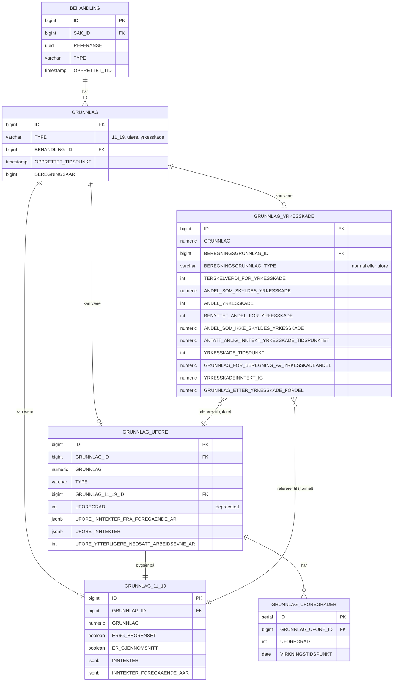

## AAP Statistikk

[](https://github.com/navikt/aap-statistikk/actions/workflows/release.yaml)

Formålet er å levere statistikk og produkssjonstyringsdata relatert til AAP.

## Komme i gang

Bruker Gradle wrapper, så bare klon og kjør `./gradlew build`.

Dokumentasjon på [sysdok](https://aap-sysdoc.ansatt.nav.no/funksjonalitet/Statistikk/teknisk).

## Henvendelser

Spørsmål knyttet til koden eller prosjektet kan stilles som issues her på GitHub.

# For NAV-ansatte

Interne henvendelser kan sendes via Slack i kanalen `#ytelse-aap-værsågod`.


## Oppdatere Gradle wrapper

For å oppdatere Gradle wrapper: 

```
./gradlew wrapper --gradle-version=8.10.2
```

Commit genererte endringer og push.

 ## Database Modell - Beregningsgrunnlag Tabeller

    ### Oversikt

    Beregningsgrunnlag-tabellene lagrer ulike typer beregningsgrunnlag for AAP-behandlinger. Det finnes tre hovedtyper av grunnlag:
    1. **Grunnlag 11-19** (`type = "11_19"`): Standard beregningsgrunnlag basert på inntektshistorikk
    2. **Grunnlag Uføre** (`type = "uføre"`): Beregningsgrunnlag for personer med uføregrad
    3. **Grunnlag Yrkesskade** (`type = "yrkesskade"`): Beregningsgrunnlag der yrkesskade er involvert

    ### Viktig om modellering (slik det faktisk er implementert)

    *`GRUNNLAG` er “rot”-tabellen.* Hver beregningsgrunnlag-lagring oppretter en rad i `GRUNNLAG`, og eventuelle detaljer ligger i egne tabeller.

    **Yrkesskade peker på `GRUNNLAG` (base), ikke direkte på `GRUNNLAG_11_19` eller `GRUNNLAG_UFORE`:**
    - `GRUNNLAG_YRKESSKADE.beregningsgrunnlag_id` = `GRUNNLAG.id` for yrkesskade-raden.
    - `GRUNNLAG_YRKESSKADE.beregningsgrunnlag_type` (`"normal"` / `"ufore"`) forteller hvilken “understruktur” som finnes under samme `GRUNNLAG.id`:
      - `"normal"` ⇒ det finnes en rad i `GRUNNLAG_11_19` med `GRUNNLAG_11_19.grunnlag_id = GRUNNLAG.id`
      - `"ufore"` ⇒ det finnes en rad i `GRUNNLAG_UFORE` med `GRUNNLAG_UFORE.grunnlag_id = GRUNNLAG.id`
        (og `GRUNNLAG_UFORE` peker videre til sin underliggende `GRUNNLAG_11_19` via `grunnlag_11_19_id`)

    Dette gjør at en “hent”-spørring kan hente alt i én omgang ved å starte i `GRUNNLAG` og gjøre `LEFT JOIN` ut til de relevante tabellene.

    ### ER-Diagram (oppdatert)

    ```mermaid
    erDiagram
        BEHANDLING ||--o{ GRUNNLAG : "har"

        GRUNNLAG ||--o| GRUNNLAG_11_19 : "kan ha (grunnlag_id)"
        GRUNNLAG ||--o| GRUNNLAG_UFORE : "kan ha (grunnlag_id)"
        GRUNNLAG ||--o| GRUNNLAG_YRKESSKADE : "kan ha (beregningsgrunnlag_id -> GRUNNLAG.id)"

        GRUNNLAG_UFORE ||--|| GRUNNLAG_11_19 : "bygger på (grunnlag_11_19_id)"
        GRUNNLAG_UFORE ||--o{ GRUNNLAG_UFOREGRADER : "har"

        BEHANDLING {
            bigint ID PK
            uuid REFERANSE
        }

        GRUNNLAG {
            bigint ID PK
            varchar TYPE "11_19, uføre, yrkesskade"
            bigint BEHANDLING_ID FK
            timestamp OPPRETTET_TIDSPUNKT
            bigint BEREGNINGSAAR
        }

        GRUNNLAG_11_19 {
            bigint ID PK
            bigint GRUNNLAG_ID FK
            numeric GRUNNLAG
            boolean ER6G_BEGRENSET
            boolean ER_GJENNOMSNITT
            jsonb INNTEKTER
            jsonb INNTEKTER_FOREGAAENDE_AAR
        }

        GRUNNLAG_UFORE {
            bigint ID PK
            bigint GRUNNLAG_ID FK
            numeric GRUNNLAG
            varchar TYPE
            bigint GRUNNLAG_11_19_ID FK
            int UFOREGRAD "deprecated"
            jsonb UFORE_INNTEKTER_FRA_FOREGAENDE_AR
            jsonb UFORE_INNTEKTER
            int UFORE_YTTERLIGERE_NEDSATT_ARBEIDSEVNE_AR
        }

        GRUNNLAG_UFOREGRADER {
            serial ID PK
            bigint GRUNNLAG_UFORE_ID FK
            int UFOREGRAD
            date VIRKNINGSTIDSPUNKT
        }

        GRUNNLAG_YRKESSKADE {
            bigint ID PK
            numeric GRUNNLAG
            bigint BEREGNINGSGRUNNLAG_ID FK "peker på GRUNNLAG.id"
            varchar BEREGNINGSGRUNNLAG_TYPE "normal eller ufore"
            int TERSKELVERDI_FOR_YRKESSKADE
            numeric ANDEL_SOM_SKYLDES_YRKESSKADE
            int ANDEL_YRKESSKADE
            int BENYTTET_ANDEL_FOR_YRKESSKADE
            numeric ANDEL_SOM_IKKE_SKYLDES_YRKESSKADE
            numeric ANTATT_ARLIG_INNTEKT_YRKESSKADE_TIDSPUNKTET
            int YRKESSKADE_TIDSPUNKT
            numeric GRUNNLAG_FOR_BEREGNING_AV_YRKESSKADEANDEL
            numeric YRKESSKADEINNTEKKT_IG
            numeric GRUNNLAG_ETTER_YRKESSKADE_FORDEL
        }
    ```

    ### Datamodell Forklaring

    #### GRUNNLAG (Base tabell)
    Hovedtabellen som alle beregningsgrunnlag starter fra:
    - **TYPE**: Diskriminerer hvilken type grunnlag (`11_19`, `uføre`, `yrkesskade`)
    - **BEHANDLING_ID**: Kobler grunnlaget til en behandling
    - **BEREGNINGSAAR**: Året beregningen gjelder for
    - **OPPRETTET_TIDSPUNKT**: Når grunnlaget ble opprettet

    #### GRUNNLAG_11_19
    Standard beregningsgrunnlag:
    - **GRUNNLAG_ID**: FK til `GRUNNLAG.id`
    - **INNTEKTER_FOREGAAENDE_AAR**: JSONB-liste på formen `[{"aar": 2023, "inntekt": 500000.0}]`

    #### GRUNNLAG_UFORE
    Uføregrunnlag:
    - **GRUNNLAG_ID**: FK til `GRUNNLAG.id`
    - **GRUNNLAG_11_19_ID**: FK til underliggende `GRUNNLAG_11_19.id`
    - **UFOREGRAD**: høyeste uføregrad (bakoverkompatibilitet)
    - **UFORE_INNTEKTER**: JSONB-liste med inntekter per år

    #### GRUNNLAG_YRKESSKADE
    Yrkesskadegrunnlag:
    - **BEREGNINGSGRUNNLAG_ID**: peker på `GRUNNLAG.id` (samme “base”-rad som resten av yrkesskadegrunnlaget ligger under)
    - **BEREGNINGSGRUNNLAG_TYPE**: `"normal"` eller `"ufore"` (styrer om detaljene ligger under `GRUNNLAG_11_19` eller `GRUNNLAG_UFORE` for samme base-id)

    ### Relasjoner og Hierarki (oppdatert)

    1. **Enkel 11-19**: `GRUNNLAG(type=11_19)` → `GRUNNLAG_11_19(grunnlag_id)`
    2. **Uføre**: `GRUNNLAG(type=uføre)` → `GRUNNLAG_UFORE(grunnlag_id)` → `GRUNNLAG_11_19(id=grunnlag_11_19_id)` (+ `GRUNNLAG_UFOREGRADER`)
    3. **Yrkesskade normal**: `GRUNNLAG(type=yrkesskade)` → `GRUNNLAG_YRKESSKADE(beregningsgrunnlag_id = GRUNNLAG.id, type=normal)` + `GRUNNLAG_11_19(grunnlag_id)`
    4. **Yrkesskade uføre**: `GRUNNLAG(type=yrkesskade)` → `GRUNNLAG_YRKESSKADE(beregningsgrunnlag_id = GRUNNLAG.id, type=ufore)` + `GRUNNLAG_UFORE(grunnlag_id)` → `GRUNNLAG_11_19(...)`

### ER-Diagram



### Datamodell Forklaring

#### GRUNNLAG (Base tabell)
Hovedtabellen som alle beregningsgrunnlag starter fra:
- **TYPE**: Diskriminerer hvilken type grunnlag (11_19, uføre, eller yrkesskade)
- **BEHANDLING_ID**: Kobler grunnlaget til en behandling
- **BEREGNINGSAAR**: Året beregningen gjelder for
- **OPPRETTET_TIDSPUNKT**: Når grunnlaget ble opprettet

#### GRUNNLAG_11_19
Standard beregningsgrunnlag basert på §11-19:
- **GRUNNLAG**: Det beregnede grunnlagsbeløpet
- **ER6G_BEGRENSET**: Om grunnlaget er begrenset til 6G (grunnbeløp)
- **ER_GJENNOMSNITT**: Om grunnlaget er beregnet som gjennomsnitt
- **INNTEKTER_FOREGAAENDE_AAR**: JSONB med inntekter fra foregående år (format: `[{"aar": 2023, "inntekt": 500000.0}]`)

#### GRUNNLAG_UFORE
Beregningsgrunnlag for personer med uføregrad:
- **GRUNNLAG**: Det justerte grunnlagsbeløpet basert på uføregrad
- **TYPE**: Type uføre (f.eks. UFORE_INNTEKT_FORRIGE_AAR)
- **GRUNNLAG_11_19_ID**: Referanse til underliggende §11-19 grunnlag
- **UFOREGRAD**: Høyeste uføregrad (for bakoverkompatibilitet)
- **UFORE_INNTEKTER**: JSONB med inntekter per år (format: `[{"aar": 2023, "inntekt": 300000.0}]`)
- **UFORE_YTTERLIGERE_NEDSATT_ARBEIDSEVNE_AR**: År med ytterligere nedsatt arbeidsevne

#### GRUNNLAG_UFOREGRADER
Separate tabell for å lagre flere uføregrader over tid:
- **GRUNNLAG_UFORE_ID**: Referanse til hovedtabellen
- **UFOREGRAD**: Uføregradsandel (0-100)
- **VIRKNINGSTIDSPUNKT**: Når uføregraden gjelder fra

#### GRUNNLAG_YRKESSKADE
Beregningsgrunnlag når yrkesskade er involvert:
- **BEREGNINGSGRUNNLAG_ID**: Referanse til enten GRUNNLAG_11_19 eller GRUNNLAG_UFORE
- **BEREGNINGSGRUNNLAG_TYPE**: "normal" (11-19) eller "ufore"
- **GRUNNLAG**: Det endelige beregnede grunnlaget etter yrkesskadejustering
- Inneholder detaljerte felter for yrkesskadeberegning som terskelverdi, andeler, og yrkesskadeinntekter

### Relasjoner og Hierarki

1. **Enkel 11-19**: GRUNNLAG → GRUNNLAG_11_19
2. **Uføre**: GRUNNLAG → GRUNNLAG_UFORE → GRUNNLAG_11_19 (+ GRUNNLAG_UFOREGRADER)
3. **Yrkesskade med 11-19**: GRUNNLAG → GRUNNLAG_YRKESSKADE → GRUNNLAG_11_19
4. **Yrkesskade med uføre**: GRUNNLAG → GRUNNLAG_YRKESSKADE → GRUNNLAG_UFORE → GRUNNLAG_11_19

Alle typer grunnlag bygger på §11-19 beregningen som fundament, men legger på ulike justeringer avhengig av personens situasjon (uføregrad, yrkesskade, eller kombinasjon).
